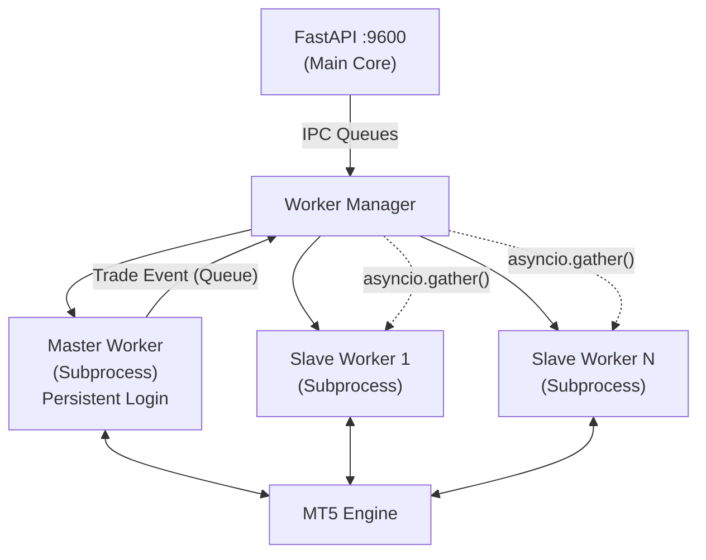

<div align="center">
  
  
  
  
  
</div>

<br>

<div align="center">
  <h1 align="center">MTCS v2 (MetaTrader Copy System)</h1>
  <p align="center">
    <strong>A High-Performance, Parallel Execution Engine for MT5 Copy Trading</strong>
  </p>
</div>

<hr>

## 📖 Overview

**MTCS v2** is an advanced, multi-process copy-trading system built specifically for MetaTrader 5. It is designed to bridge the gap between institutional-grade execution speed and retail accessibility. 

Moving away from legacy single-thread bot architectures, MTCS utilizes a **Parallel IPC (Inter-Process Communication) Engine**. This means each connected MT5 account operates within its own dedicated, persistent OS subprocess. When the Master account executes a trade, the system broadcasts the signal instantaneously to all connected Slave nodes simultaneously, achieving near-zero latency multi-account copy trading.

The accompanying web interface provides a sleek, minimalist, and highly professional dark-themed dashboard inspired by institutional trading terminals like Bloomberg and advanced crypto exchanges.

---

## ✨ Core Features

### 🚀 Parallel Execution Architecture
*   **Multi-Process Engine:** Master and Slave MT5 terminal connections are encapsulated in long-running individual OS subprocesses.
*   **Zero-Latency Broadcasting:** Master events are piped via asynchronous queues directly to the `WorkerManager`, which uses `asyncio.gather()` to beam execution commands to all slave nodes concurrently.
*   **Persistent Connections:** Sidesteps the heavy latency of repeatedly logging in and out of the MT5 API by keeping all terminal instances permanently active alongside their respective UI threads.

### 🛡️ Advanced Risk Management Core
Control exactly how trades map from the Master to your Slaves with precision configuration:
*   **Lot Sizing Strategies:**
    *   **Multiplier Modes:** Scale master lots by a defined ratio (`Master Lot × Multiplier`).
    *   **Fixed Lot:** Force a strict, unchanging volume for all copied trades on a specific slave.
    *   **Equity Percentage:** Dynamically calculate the slave lot based on a percentage of its available equity matching the master's risk profile.
*   **Execution Safety Rails:** Definable Maximum Slippage constraints and Maximum Spread allowance filters to prevent brutal spread execution during high-impact news.
*   **Hard Overrides:** Global `Daily Max Drawdown ($)` and `Daily Target Profit ($)` stop-outs.

### 💻 Institutional Minimal UI
A complete frontend rewrite using clean, semantic HTML5, Alpine.js reactivity, and Tailwind CSS.
*   **Server-Sent Events (SSE):** Live equity, open positions, floating PnL, and system state metrics stream instantly to the DOM without client looping or refreshing.
*   **Flat Dark Aesthetic:** Visually refined, no-nonsense UI completely stripped of distracting glows or heavy shadows—optimized for maximum data density and minimum eye strain during long trading sessions.
*   **Quick & Fast Execution:** Fully integrated Keyboard Shortcuts (`Shift+B` to Buy, `Shift+S` to Sell), 1-Click Instant position closing, and lightning volume modification chips.

### 📈 Manual Interventions & Live Quotes
*   **The Trading Widget:** Trade your Master account directly from the web dashboard. Manual market executions or limit orders placed via the UI immediately trigger the Parallel Engine and copy downwards.
*   **Instant Real-Time Quotes:** High density, rapidly scanning Data Grid for Live Bid/Ask. Features 1-click order execution straight off the Bid/Ask quote spread rows.
*   **Full History Tracking:** Accurately pulls 100% of authentic trade history securely from broker servers irrespective of broker timezone biases.

---

## 🏗️ Architecture



---

## 🛠️ Tech Stack

*   **Backend:** Python 3.10+, FastAPI, Asyncio, Multiprocessing, SQLite
*   **Trading API:** `MetaTrader5` Official Python Library
*   **Frontend UI:** Tailwind CSS, Alpine.js, HTMX, FeatherIcons
*   **Comms:** Server-Sent Events (SSE), API JSON REST

---

## 📋 Installation & Fast Setup

### Prerequisites
1.  **Python 3.10** or higher installed and added to `PATH`.
2.  **MetaTrader 5 Client Terminal** installed on your Windows machine.
3.  Ensure your MT5 broker accounts permit **Algo Trading** (The "Algo Trading" button on the top MT5 toolbar must be green).

### Local Setup
1.  **Clone the Repository**
    ```bash
    git clone https://github.com/Praveens1234/mtcs.git
    cd mtcs
    ```

2.  **Install Python Dependencies**
    ```bash
    pip install -r requirements.txt
    ```

3.  **Boot the Application**
    ```bash
    python run.py
    ```

4.  **Access the Terminal**
    Open your browser and navigate to:
    `http://localhost:9600`

---

## ⚙️ Configuration & Usage

### 1. Connecting Nodes
Navigate to the **Accounts** tab. First, register your Primary Master Node. Then, map your required Slave Nodes. Ensure you select the correct MT5 Server string accurately as provided by your broker.

### 2. Defining Target Risk
Within the Accounts tab, tap the `Risk` icon on any active Slave to spawn the Advanced Risk Modal. Here you can configure specific volume scaling and max drawdown rules unique to that follower account.

### 3. Deploy The Engine
Return to the **Dashboard** and press the master power button to `START ENGINE`. The system will spawn the subprocess workers. Watch the state transition to `COPYING ACTIVE`. Any trades now executed on the mapped Master terminal will instantly reflect across the Slave grid.

---

## 🔒 Security Best Practices
- **Never expose your backend to the public internet** without proper NGINX/Apache reverse proxies equipped with robust SSL implementation and rigid IP-whitelisting.
- The default configurations and HTTP deployments `localhost:9600` are strictly designed for secure, local machine operation alongside local MT5 instances.

## 🧪 Testing

A new test suite structure has been implemented. To run tests:
```bash
pip install pytest
pytest tests/
```

---

<div align="center">
  <p><i>Building the future of algorithmic execution systems.</i></p>
</div>
